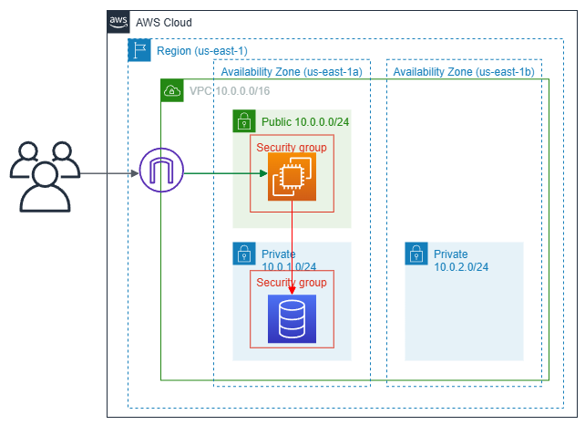

# ☁ AWS Terraform Learning Project

This repository contains a small Terraform project created as part of a school assignment to learn the usage of Terraform on AWS Cloud.

## 📚 Project Overview

The goal of this project is to understand the basics of Terraform and how it can be used to provision and manage infrastructure on AWS. 



The project includes the following components:
- VPC (Virtual Private Cloud)
- Subnets
- Internet Gateway
- Route Tables
- EC2 Instance
- RDS Instance

## ✅ Prerequisites

Before you begin, ensure you have the following installed:
- [Terraform](https://www.terraform.io/downloads.html) (v0.12 or later)
- [AWS CLI](https://aws.amazon.com/cli/) configured with your AWS credentials

## 🚀 Usage

1. **Initialize Terraform:**
    ```sh
    terraform init
    ```

2. **Plan the infrastructure:**
    ```sh
    terraform plan
    ```

3. **Apply the configuration:**
    ```sh
    terraform apply
    ```

4. **Destroy the infrastructure (when no longer needed):**
    ```sh
    terraform destroy
    ```

## 🗂️ Project Structure

- `main.tf`: Contains the configuration for AWS.
- `var.tf`: Defines the input variables for the project.
- `prod.tf` & `vpc.tf`: Define all the components of the architecture.

## ⚠️ Disclaimer

This repository is an archive of a school project and is no longer actively maintained. The scripts and configurations provided are for educational purposes only and may not be suitable for production environments.
